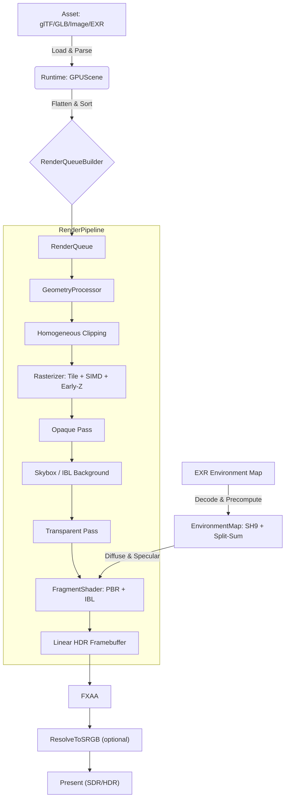

# SoftRasterizer

纯自研软件光栅化渲染器，旨在在 CPU 上完整复现 GPU 渲染管线，并极致挖掘性能潜力。

> Why use a GPU when you can heat up your CPU?

[](LICENSE)
[](https://en.cppreference.com/w/cpp/20)
[]()

## 项目亮点

- **零第三方依赖**：摒弃现成数学、图像及模型加载库，核心算法完全手写。
- **现代化 C++**：基于 C++20 标准，利用 OpenMP 实现**全管线多核并行**——从几何处理、裁剪、Binning 到光栅化主循环及后处理，几乎无串行瓶颈。
- **DirectX 风格管线**：采用左手坐标系，NDC 深度 $[0,1]$，近平面 $z\ge 0$。
- **完整 PBR 渲染**：实现 Cook-Torrance BRDF (GGX + Smith + Fresnel-Schlick)。
- **IBL 环境光照**：手写 EXR 解码器 + Split-Sum 预过滤镜面反射 + SH9 漫反射辐照度 + 天空盒背景。
- **原生 HDR 支持**：内部采用线性 HDR 缓冲，支持 Tone Mapping 及 sRGB 转换（含 LUT 加速与抖动处理）。
- **D3D12 显示后端**：Demo 使用 D3D12 仅作 Present 用途，将 CPU 线性像素上传至 `R16G16B16A16_FLOAT` 后台缓冲实现 HDR 输出。

## 渲染管线（从 Scene 到像素）

高层数据流：

```
Scene / GPUScene
  -> RenderQueueBuilder / GPUSceneRenderQueueBuilder (扁平化 + 排序)
  -> RenderPipeline
        1) GeometryProcessor: 顶点变换 + 三角形装配       [OMP 多 DrawItem 并行]
        2) Clipper: Sutherland-Hodgman 视锥裁剪           [OMP 每线程独立 Clipper 并行]
        3) Rasterizer: tile-based + SIMD + early-z        [OMP Binning 并行 + Tile 并行]
           └─ 不透明 → 天空盒(IBL) → 透明混合            [正确的渲染顺序]
        4) FragmentShader: PBR + IBL 着色                 [Tile 内逐像素着色]
        5) PostProcess: FXAA + ToneMap/ResolveToSRGB      [OMP 并行]
  -> Present (SDR: GDI/窗口输出, HDR: D3D12 HDRPresenter)
```

对应实现入口：

- `RenderPipeline`：`SoftRenderer/src/Render/RenderPipeline.cpp`
- `Rasterizer`：`SoftRenderer/src/Pipeline/Rasterizer.cpp`
- `FragmentShader`：`SoftRenderer/src/Pipeline/FragmentShader.cpp`
- `EnvironmentMap`：`SoftRenderer/src/Pipeline/EnvironmentMap.cpp`
- `Framebuffer`：`SoftRenderer/src/Core/Framebuffer.cpp`
- `HDRPresenter`：`MFCDemo/src/HDRPresenter.cpp`

## 关键算法与"硬核点"展开

### 1) 齐次裁剪：Sutherland-Hodgman（DirectX 风格）

裁剪发生在 Clip Space（投影后、除法前），避免边缘伪影与穿近裁剪面导致的爆炸。

项目使用 6 个平面做全视锥裁剪，判定式与 DirectX NDC 深度约定一致：

- $x \ge -w$，$x \le w$
- $y \ge -w$，$y \le w$
- $z \ge 0$（近平面）
- $z \le w$（远平面）

裁剪时对 `clip/normal/world/texCoord/tangent` 做线性插值，得到新的多边形顶点，再重组三角形进入后续光栅化。

### 2) 透视校正插值：基于透视原理修正畸变

插值是软件光栅化中最易出错的环节。本项目对纹理坐标、法线/切线、世界坐标等属性均实施了严格的透视校正：

设三角形屏幕空间重心坐标为 $b_0,b_1,b_2$，每个顶点齐次坐标的 $w$ 为 $w_0,w_1,w_2$，属性为 $a$，则：

$$
\tilde a = \frac{b_0\,a_0/w_0 + b_1\,a_1/w_1 + b_2\,a_2/w_2}{b_0\,1/w_0 + b_1\,1/w_1 + b_2\,1/w_2}
$$

这一步是"纹理不拉伸、法线不跑偏"的根本保证。

### 3) 光栅化：全管线并行 + Tile-Based + 早深度 + AVX2 SIMD

光栅化通常是软渲染的性能瓶颈，本项目为此集成了多项 CPU 关键优化技术：

1. **Tile-based 分块（32x32）**
    - 先将三角形 binning 到覆盖的 tile（避免跨线程写同一像素导致锁/原子）。
    - 每个 tile 内按三角形 `zMin` 排序（前到后），为 early-z 提供更高命中率。

2. **全管线 OpenMP 并行化（从帧头到帧尾几乎无串行瓶颈）**
    - **几何阶段**：多 DrawItem 并行处理，每线程独立 `GeometryProcessor` + 本地三角形列表，结束后 move 合并。
    - **裁剪阶段**：每线程独立 `Clipper` 实例 + 本地 `RasterTriangle` 向量，完全无锁并行裁剪。
    - **Binning 计数**：每线程独立直方图，`omp critical` 归约合并。
    - **Binning 填充**：`_InterlockedExchangeAdd64` 原子写游标，各线程并行填充索引。
    - **Tile 光栅化**：`schedule(dynamic, 1)` 动态分配 tile，每线程独立 `FragmentShader` 实例。
    - **清除/后处理**：DepthBuffer、Framebuffer 清除及 FXAA、ToneMap 均为 OpenMP 并行。

3. **早深度测试（Early-Z）**
    - 在昂贵的插值与 PBR 着色之前先做 `depth` 比较：不通过就直接跳过，避免白算。

4. **SIMD 路径（AVX2，4 像素一组）**
    - 使用 `__m256d` 处理 4 个像素的边函数与重心坐标，批量算 depth、invW、插值因子。
    - 标量路径只负责"尾巴像素"，减少分支与杂音。

5. **写入路径极简化**
    - 直接拿到 `Framebuffer` 线性 HDR 缓冲的可写指针与 `DepthBuffer` 原始指针，减少函数调用与边界检查开销。

简而言之，这是一个从帧头到帧尾**几乎无串行瓶颈**的 CPU 光栅化器，而非低效的简单像素循环。

### 4) 片元着色：Cook-Torrance PBR（并带有 fast path）

着色器实现了完整的微表面 BRDF：

- Fresnel：Fresnel-Schlick（`pow5` 快速实现）
- NDF：GGX
- Geometry：Smith（Schlick-GGX）

核心形式：

$$
f_r = \frac{D\,G\,F}{4 (n\cdot v)(n\cdot l)} + \frac{k_D\,\text{albedo}}{\pi}
$$

并且支持典型 glTF Metallic-Roughness 材质链路：

- BaseColor（可 sRGB 解码）
- Metallic/Roughness（B=metallic，G=roughness）
- Normal mapping（TBN 变换到世界空间）
- Occlusion（AO）
- Emissive（可 sRGB 解码）

为了更贴近"真实渲染器"的性能路径，项目提供了优化版本 `ShadeFast`：

- **把三角形级常量（Context）与像素级变量（Varying）拆分**，避免每像素重复搬运。
- **每帧预计算光源数据**（光向量 `L`、radiance），在 tile/work-item 内复用。
- **关键向量归一化、半程向量 H 的构造尽量 inline**，减少函数调用开销。

### 5) IBL：Image-Based Lighting（Split-Sum + SH9）

本项目实现了完整的基于图像的光照（IBL），为 PBR 材质提供真实的环境反射与漫反射。

**架构概览**：

```
EXR 文件 → EXRDecoder → HDRImage
  → EnvironmentMap 预计算:
      1) SH9 漫反射辐照度 (Spherical Harmonics L=2, 9 系数)     [OMP 并行]
      2) Split-Sum 镜面反射预过滤 (6 mip, GGX 重要性采样)       [OMP 并行]
      3) BRDF LUT (128×128, 积分 F₀ scale + bias)              [OMP 并行]
  → 运行时:
      漫反射: EvalDiffuseSH(N) → 9 个基函数加权求和
      镜面反射: SampleSpecular(R, roughness) + LookupBRDF(NdotV, roughness)
```

**关键实现细节**：

1. **EXR 解码器（零依赖手写）**
    - 支持 Scanline 格式，NONE / ZIP / ZIPS 压缩。
    - 手写 zlib inflate（fixed + dynamic Huffman），复用 PNG 解码器的实现。
    - 正确还原 OpenEXR 的 delta predictor（**含 +128 偏移**）和字节交织（even/odd split）。
    - 支持 HALF（fp16）和 FLOAT（fp32）像素类型，自动提取 R/G/B 通道。

2. **漫反射：球谐函数 L=2（9 个系数）**
    - 遍历环境贴图所有像素，投影到 9 个 SH 基函数，每通道独立积分。
    - 运行时只需 9 次乘加即可得到任意法线方向的辐照度——比逐像素采样快几个数量级。

3. **镜面反射：Split-Sum 预过滤**
    - 对 6 个粗糙度等级（0.0 ~ 1.0）生成预过滤 mip 链。
    - 每个 mip 使用 **GGX 重要性采样**（Hammersley 低差异序列 + ImportanceSampleGGX）。
    - BRDF LUT 128×128 预积分 $\int F_0\,\text{scale} + \text{bias}$，运行时查表即可。

4. **天空盒渲染**
    - 通过逆 VP 矩阵从 NDC 还原世界空间射线方向，对 `depth == 1.0` 的远平面像素采样环境贴图。
    - 渲染顺序：**不透明几何 → 天空盒 → 透明几何**，确保透明物体正确混合在天空盒之上。

### 6) 后处理：FXAA + ResolveToSRGB（并行 + LUT）

1. **FXAA（Fast Approximate Anti-Aliasing）**
    - 基于亮度梯度估计边缘方向，沿边缘方向采样并重建颜色。
    - 并行按行/像素分发，使用临时缓冲交换，避免读写冲突。

2. **ToneMap/ResolveToSRGB（HDR -> SDR）**
    - 线性 HDR 先做曝光控制，再做 sRGB 转换。
    - 使用高精度 LUT（1024 entries）加速 linear->sRGB。
    - 支持轻量抖动模式（Bayer 风格 2x2 模式），用于减轻 banding。
    - OpenMP 并行遍历像素，适合大分辨率。

### 7) HDR 输出：使用 D3D12 作为显示后端

`MFCDemo` 的 HDR 路径并非将渲染任务卸载至 GPU，而是：

- CPU 渲染得到线性浮点像素（`Vec3`）。
- CPU 侧把 float 转 half（R16G16B16A16）写入 Upload Buffer。
- D3D12 录制 Copy 命令把 Upload Buffer 拷贝到后台缓冲纹理。
- Fence 同步保证帧资源安全复用，然后 Present。

这条链路的核心价值是：**渲染完全在 CPU**，但依然可以走 HDR 显示链路。

### 8) Asset：零依赖 glTF/GLB + BufferAccessor + PNG/JPEG/EXR

若仅实现渲染逻辑而缺失资产加载能力，项目往往局限于简单的几何体演示。本项目的 Asset 层旨在：
**在完全不引入第三方库的前提下**，将 glTF 2.0（含 GLB 容器）解析为 `GLTFAsset`，并转换为 Runtime 层的 `GPUScene`。

已实现的核心模块：

1. **JSONParser：递归下降 + UTF-16 转 UTF-8**
    - 支持 null/bool/number/string/array/object。
    - `string` 支持常见转义与 `\uXXXX`（含 surrogate pair）。
    - `number` 使用 `std::from_chars` 解析，减少 `std::stod` 风格开销。
    - 记录 `lastError`，并通过 `OutputDebugStringA` 输出解析耗时。

2. **BufferAccessor：按 accessor/type/componentType 解包（含 normalized）**
    - 支持 `BYTE/UBYTE/SHORT/USHORT/UINT/FLOAT` 与 `SCALAR/VEC2/VEC3/VEC4/MAT3/MAT4` 的常见组合。
    - 支持 `bufferView.byteStride`（0 表示紧密排列）。
    - `normalized=true` 时把整数按规范映射到 $[0,1]$ 或 $[-1,1]$（有符号类型）。
    - 直接从 `GLTFBuffer` 字节流读取并转换为 `Vec2/Vec3/Vec4/double/uint32_t` 等目标类型。

3. **ImageDecoder：PNG + JPEG（自带 Inflate + Unfilter/IDCT）**
    - PNG：解析 chunk（IHDR/PLTE/tRNS/IDAT/IEND），自带 zlib inflate（fixed+dynamic Huffman），并实现 5 种 filter（含 Paeth）。
      - 支持非交错（interlace=0），并覆盖常用颜色类型：灰度/真彩/带 alpha/索引色（含调色板展开）。
    - JPEG：基线 JPEG 解码路径（量化表 + Huffman 表 + MCU 扫描），解码后做 IDCT 8x8，最后 YCbCr -> RGB。
    - 统一入口按 `mimeType` 分发，`mimeType` 为空时可通过文件签名自动识别 PNG/JPEG。

4. **EXRDecoder：HDR 环境贴图加载（手写 ZIP/ZIPS 解压）**
    - 解析 OpenEXR header（magic/version/channels/compression/dataWindow）。
    - 支持 NONE、ZIP（16 行/块）、ZIPS（1 行/块）三种压缩模式。
    - 手写 zlib inflate + OpenEXR delta predictor（含 +128 偏移）+ 字节交织还原。
    - 支持 HALF（fp16 → float 转换）和 FLOAT（fp32）像素类型。
    - 按字母序通道排列中自动定位 R/G/B 通道，输出为 `HDRImage`（float RGB）。

5. **GLTFLoader：LoadGLTF + LoadGLB（含 data URI / BIN chunk）**
    - GLB：校验 magic/version/length，遍历 chunk（JSON/BIN），支持 "JSON chunk + BIN chunk"。
    - glTF：读取 JSON 文本，基于 `basePath` 解析外部资源。
    - 支持 buffer：`uri` 外链文件 / `data:` URI（base64）/ GLB 的 BIN chunk。
    - 支持 image：`uri` 外链 / `data:` URI / `bufferView` 内嵌，并调用 `ImageDecoder` 解码。
    - 解析并填充 `buffers/bufferViews/accessors/images/samplers/textures/materials/meshes/nodes/scenes`，并设置 `defaultSceneIndex`。
    - 贴图颜色空间标记：对 BaseColor/Emissive 纹理做 sRGB 标记，供渲染阶段采样时正确解码。

对应实现入口：

- `JSONParser`：`SoftRenderer/src/Asset/JSONParser.cpp`
- `BufferAccessor`：`SoftRenderer/include/Asset/BufferAccessor.inl`
- `ImageDecoder`：`SoftRenderer/src/Asset/ImageDecoder.cpp`
- `EXRDecoder`：`SoftRenderer/src/Asset/EXRDecoder.cpp`
- `GLTFLoader`：`SoftRenderer/src/Asset/GLTFLoader.cpp`

## 数值与坐标系约定

- 坐标系：左手坐标系（+Z 入屏）。
- NDC 深度范围：$[0,1]$。
- 矩阵存储：行主序，向量左乘 `v' = v * M`。
- MVP 顺序：`Model * View * Projection`。
- 数学精度：核心数学类型以 `double` 为主（更稳定、更容易排查数值问题）。

## 构建与运行

本项目基于 CMake 构建，依赖 Windows SDK（窗口与 D3D12 Present）。

环境要求：

- Windows 10/11
- Visual Studio 2022（MSVC，支持 C++20）
- CMake 3.20+

编译与运行：

```powershell
# 1) 配置（生成 VS 解决方案）
cmake -B build -G "Visual Studio 17 2022" -A x64

# 2) 编译（Release 强烈推荐，Debug 会非常慢）
cmake --build build --config Release

# 3) 运行 Demo
.\build\MFCDemo\Release\MFCDemo.exe
```

## 操作说明（Orbit Camera）

- 鼠标左键拖拽：旋转
- 鼠标右键拖拽：平移
- 鼠标滚轮：缩放

## 架构概览



## 路线图

- [x] PBR（Cook-Torrance / GGX / Smith / Fresnel-Schlick）
- [x] 齐次裁剪（Sutherland-Hodgman，全视锥）
- [x] 透视校正插值 + 深度缓冲
- [x] Tile-based 并行光栅化（32x32）+ AVX2 4 像素 SIMD
- [x] 全管线 OpenMP 并行化（几何 / 裁剪 / Binning / 光栅化 / 清除 / 后处理）
- [x] FXAA + HDR->sRGB Resolve（LUT 加速）
- [x] glTF/GLB 基础加载链路（Asset：JSON/BufferAccessor/ImageDecoder/Loader）
- [x] IBL 环境光照（EXR 解码 / SH9 漫反射 / Split-Sum 镜面反射 / BRDF LUT / 天空盒）
- [ ] glTF 2.0 "完整支持"：Skinning / Animation / Morph Targets / KTX2(BasisU) / Draco 等
- [ ] 更激进的 TBR：Hi-Z / tile-level early-out
- [ ] 手写更宽 SIMD（AVX-512）与关键算子专用向量化
- [ ] 阴影（Shadow Mapping）与更多光源类型

## License

MIT License. Copyright (c) 2024-2026.
