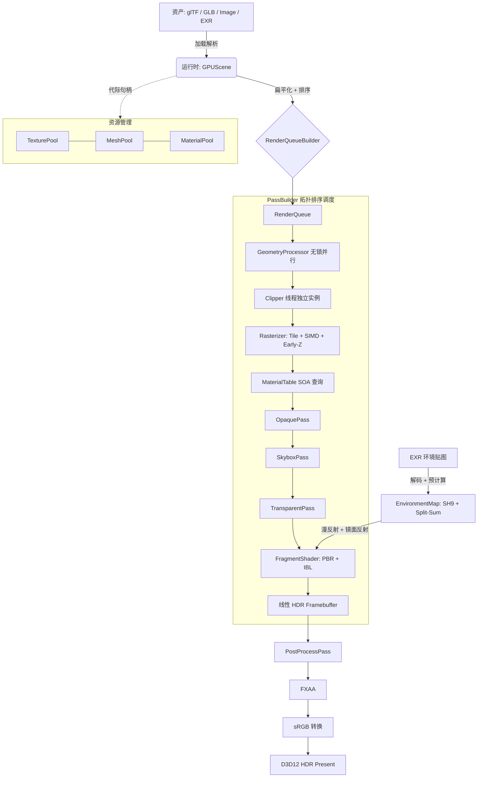

# SoftRasterizer

纯 C++20 手搓的软件光栅化渲染器——在 CPU 上完整复刻现代 GPU 渲染管线（DirectX 风格），榨干每一个时钟周期。

> 谁说 CPU 不能当显卡？

[](LICENSE)
[](https://en.cppreference.com/w/cpp/20)
[]()
[](https://www.openmp.org/specifications/)
[](https://en.wikipedia.org/wiki/Advanced_Vector_Extensions)
[](https://www.intel.com/content/www/us/en/developer/tools/oneapi/dpc-compiler.html)

## 目录

- [项目亮点](#项目亮点)
- [快速开始](#快速开始)
- [系统架构](#系统架构)
- [模块导航](#模块导航)
- [渲染管线详解](#渲染管线详解)
- [核心渲染算法](#核心渲染算法)
- [工程架构设计](#工程架构设计)
- [资产加载系统](#资产加载系统)
- [坐标系与数值约定](#坐标系与数值约定)
- [环境要求](#环境要求)
- [操作说明](#操作说明)
- [架构概览图](#架构概览图)
- [路线图](#路线图)
- [License](#license)

## 项目亮点

### 渲染能力

- **DirectX 风格坐标与深度**：左手坐标系，NDC 深度 $[0,1]$，近平面 $z \ge 0$。
- **完整 PBR 材质**：Cook-Torrance BRDF（GGX + Smith + Fresnel-Schlick），支持 Metallic-Roughness 工作流。
- **IBL 环境光照**：EXR 环境贴图解码，Split-Sum 预过滤镜面反射 + SH9 漫反射辐照度 + 天空盒渲染。
- **全链路 HDR**：内部全程线性 HDR 缓冲，经 FXAA 抗锯齿、ACES Filmic 色调映射、sRGB 转换后输出（LUT 加速 + 抖动减带状伪影）。

### 性能优化

- **全管线 OpenMP 并行**：几何变换、视锥裁剪、Binning、Tile 光栅化、缓冲清除、后处理——每个阶段都已并行化，串行段降到最低。
- **Tile-Based 光栅化（32×32）**：三角形先 Binning 分配到 Tile，再按 Tile 并行处理，天然消除跨线程像素写冲突。
- **Early-Z 深度预判**：在昂贵的属性插值和 PBR 着色之前先做深度测试，被遮挡的像素直接跳过。
- **AVX2+FMA3 向量化**：光栅化内循环用 `__m256d` 每批 4 像素批量计算边函数、重心坐标、深度和插值系数；`Mat4::Multiply` 用 3 次 FMA 替代 16 mul + 12 add；PBR 着色器内部点积、叉积、归一化等热点运算同样走 SIMD 路径。
- **OpenMP 精细调优**：分块并行归约消除 `critical` 瓶颈，各阶段调度策略独立可配（`OpenMPTuningOptions`），内置分阶段计时和帧统计。
- **Intel 大小核适配（开发中）**：`schedule(guided)` 搭配 KMP 亲和性绑定，缓解 P/E 核负载不均。

### 工程设计

- **多 Pass 管线系统**：Opaque → Skybox → Transparent → PostProcess，支持拓扑排序依赖解析与条件执行，扩展新 Pass 无需改动调度逻辑。
- **MaterialTable SOA 布局**：材质属性按字段连续存储，Triangle 从约 45 个字段瘦身至 23 个字段（含一个 `MaterialHandle`），缓存命中率显著提升。
- **全管线无锁**：渲染管线内部零 `std::mutex`，材质注册前置到单线程预处理阶段。
- **ResourcePool 资源池**：代际句柄防悬挂引用，O(1) LRU 淘汰配合内存预算自动回收，覆盖纹理、网格、材质三类资源。

### 零依赖资产链路

不引入任何第三方图形/图像库，从解析到解码全部手写：

- **glTF/GLB**：手写 JSON 递归下降解析器、BufferAccessor 类型映射、纹理加载与 sRGB 标记。
- **PNG/JPEG/EXR**：自带 Inflate 解压 + PNG 五种行滤波 + JPEG 基线解码（Huffman/量化/IDCT/YCbCr 转换）+ EXR ZIP/ZIPS 解压与 Half/Float 像素处理。

## 快速开始

项目使用 CMake 构建，**强烈建议 Release 模式**——Debug 下 SIMD 内联失效，性能会差数量级。

### Intel oneAPI icx-cl 构建（推荐）

`icx-cl` 基于 LLVM 后端，在 AVX2/FMA 内联、OpenMP `schedule(guided)` 以及 P+E 大小核调度等方面均优于 MSVC，是本项目的首选编译器。

需要先确保 `icx-cl` 可用——推荐直接打开"Intel oneAPI 命令提示符（for VS 2022）"，会自动设置环境变量。

```powershell
# 配置
cmake -S . -B build-icx -G "Ninja Multi-Config" -DCMAKE_C_COMPILER=icx-cl -DCMAKE_CXX_COMPILER=icx-cl

# 编译
cmake --build build-icx --config Release

# 运行
.\build-icx\MFCDemo\Release\MFCDemo.exe
```

如果安装了 oneAPI 的 Visual Studio 集成插件，也可以生成 VS 解决方案：

```powershell
cmake -S . -B build-icx-vs -G "Visual Studio 17 2022" -A x64 -T IntelLLVM
cmake --build build-icx-vs --config Release
```

### MSVC 构建（备选）

未安装 Intel oneAPI 时可直接使用 MSVC，功能完整但部分 OpenMP 调度策略会回退到 `dynamic`。

```powershell
# 配置
cmake -S . -B build -G "Visual Studio 17 2022" -A x64

# 编译
cmake --build build --config Release

# 运行
.\build\MFCDemo\Release\MFCDemo.exe
```

## 系统架构

项目由两个模块组成：

| 模块 | 定位 | 说明 |
|------|------|------|
| **SoftRenderer**（DLL） | 核心渲染引擎 | 包含 CPU 光栅化、PBR 着色、IBL 环境光照、后处理的全部逻辑 |
| **MFCDemo**（App） | Windows 桌面宿主 | 仅用 D3D12 将 CPU 渲染结果上传到 `R16G16B16A16_FLOAT` 后台缓冲做 HDR Present |

设计原则：**全部渲染逻辑在 CPU 完成**，工程组织上对齐现代 GPU 管线的概念（Pass、渲染队列、资源池、调度策略），D3D12 只负责最后一步"搬到屏幕上"。

## 模块导航

| 模块 | 职责 | 关键文件 |
|------|------|----------|
| RenderPipeline / Pass | 管线调度与多 Pass 执行 | `SoftRenderer/src/Render/RenderPipeline.cpp` |
| Rasterizer | Tile-Based + SIMD + Early-Z 光栅化 | `SoftRenderer/src/Pipeline/Rasterizer.cpp` |
| FragmentShader | PBR / IBL 片元着色 | `SoftRenderer/src/Pipeline/FragmentShader.cpp` |
| EnvironmentMap | SH9 / Split-Sum / BRDF LUT 预计算 | `SoftRenderer/src/Pipeline/EnvironmentMap.cpp` |
| Framebuffer / Depth | 颜色缓冲与深度缓冲 | `SoftRenderer/src/Core/Framebuffer.cpp` |
| ResourcePool | 纹理 / 网格 / 材质资源池 | `SoftRenderer/include/Runtime/ResourcePool.h` |
| Asset Loader | glTF / GLB / PNG / JPEG / EXR 加载 | `SoftRenderer/src/Asset/` |
| HDRPresenter | D3D12 HDR 显示输出 | `MFCDemo/src/HDRPresenter.cpp` |

## 渲染管线详解

### 数据流总览

```
Scene / GPUScene
  → RenderQueueBuilder（扁平化 + 排序）
    → RenderPipeline
        1. GeometryProcessor — 顶点变换、三角形装配
        2. Clipper — Sutherland-Hodgman 齐次裁剪
        3. Rasterizer — Binning → Tile 并行 → Early-Z → SIMD
        4. FragmentShader — PBR + IBL 着色
        5. PostProcess — FXAA → 色调映射 → sRGB 转换
  → Present（D3D12 HDRPresenter → R16G16B16A16_FLOAT 后台缓冲）
```

### Pass 执行顺序

管线按以下顺序执行各 Pass，确保遮挡、背景、透明混合和后处理的正确性：

1. **OpaquePass** — 不透明几何体，Early-Z 获益最大
2. **SkyboxPass** — IBL 天空盒，填充远平面和未写入深度的区域
3. **TransparentPass** — 透明物体，按深度从后往前排序后混合
4. **PostProcessPass** — FXAA 抗锯齿 + 色调映射

## 核心渲染算法

### 1. 齐次裁剪（Sutherland-Hodgman）

裁剪在齐次裁剪空间（投影后、透视除法前）进行，避免近平面穿透导致的顶点爆炸和边缘伪影。

按 DirectX NDC 深度约定，对 6 个视锥平面逐一裁剪：

- $x \ge -w$，$x \le w$
- $y \ge -w$，$y \le w$
- $z \ge 0$（近平面），$z \le w$（远平面）

裁剪过程中对顶点的 clip / normal / world / texCoord / tangent 等属性做线性插值，生成新的多边形顶点后重新三角化送入光栅化。

### 2. 透视校正插值

屏幕空间的线性插值会导致纹理拉伸和法线偏移，必须进行透视校正。

给定屏幕空间重心坐标 $b_0, b_1, b_2$ 和各顶点的齐次 $w$ 分量 $w_0, w_1, w_2$，属性 $a$ 的校正插值为：

$$
\tilde{a} = \frac{b_0 \, a_0 / w_0 + b_1 \, a_1 / w_1 + b_2 \, a_2 / w_2}{b_0 / w_0 + b_1 / w_1 + b_2 / w_2}
$$

### 3. Tile-Based 光栅化

光栅化是软件渲染最典型的瓶颈，本项目采用"先分块、再并行、再向量化"的三级加速策略：

**Tile 分块（32×32 像素）**
- 三角形先通过 Binning 分配到所覆盖的 Tile，每个 Tile 由独立线程处理，天然避免写冲突。
- Tile 内三角形按 `zMin` 排序，提高 Early-Z 命中率。

**全阶段 OpenMP 并行**
- 几何阶段：多 DrawItem 并行处理，每线程维护本地三角形列表，最后合并。
- 裁剪阶段：每线程持有独立的 Clipper 实例和输出缓冲，完全无锁。
- Binning 计数：每线程独立直方图，通过分块并行归约合并，彻底消除 `omp critical`。
- Binning 填充：C++20 `std::atomic_ref<size_t>` + `fetch_add` 原子游标，无锁填充索引。
- Tile 光栅化：动态调度分配 Tile，每线程持有独立的 FragmentShader 实例。
- 缓冲清除与后处理：DepthBuffer / Framebuffer 清除及 FXAA / ToneMap 均已并行化。

**Early-Z 深度预判**
- 在进入昂贵的属性插值和 PBR 着色之前，先行深度测试，未通过则直接跳过。

**AVX2+FMA3 向量化（每批 4 像素）**
- 用 `__m256d` 批量计算边函数、重心坐标、深度值和插值系数。
- 仅尾部不足 4 像素的部分回退到标量路径。
- `Mat4::Multiply` 同样使用 AVX2+FMA3，3 次 `_mm256_fmadd_pd` 完成矩阵-向量乘法。

**调度策略调优**
- `OpenMPTuningOptions` 为各阶段（clip / bin / clear / post / rasterTile / drawItemBuild）提供独立的 schedule 类型与 chunk 大小。
- Intel P+E 核场景（开发中）：`schedule(guided)` 先分大块后收小尾，搭配 KMP 亲和性减少 barrier 空等。

### 4. 片元着色（Cook-Torrance PBR）

基于微表面理论的 BRDF 模型：

- **Fresnel 项**：Schlick 近似（`pow5` 快速路径）
- **法线分布 D**：GGX / Trowbridge-Reitz
- **几何遮蔽 G**：Smith 联合形式（Schlick-GGX）

$$
f_r = \frac{D \, G \, F}{4 \, (n \cdot v)(n \cdot l)} + \frac{k_D \, \text{albedo}}{\pi}
$$

支持 glTF Metallic-Roughness 贴图组合：BaseColor / MetallicRoughness / Normal / Occlusion / Emissive。

**ShadeFast 优化路径**：
- `FragmentContext`（三角形级常量）与 `FragmentVarying`（像素级插值数据）拆分，减少每像素的重复数据搬运。
- `PrecomputedLight` 每帧预计算光照方向与辐射度，Tile 内全部三角形零拷贝复用。
- PBR 着色内部大量使用 AVX2 向量化（`v3_load` / `v3_dot` / `v3_cross` 等），关键点积、叉积、归一化均走 SIMD 路径。

### 5. IBL 环境光照（Split-Sum + SH9）

**离线预计算**：

```
EXR 环境贴图 → EXRDecoder → HDRImage
  → SH9 漫反射辐照度系数（OpenMP 并行积分）
  → GGX 镜面预过滤（OpenMP 并行，逐 mip 层级）
  → BRDF LUT 128×128（OpenMP 并行）
```

**运行时查询**：

- 漫反射：`EvalDiffuseSH(N)` — 用法线查询 9 阶球谐系数，加权求和
- 镜面反射：`SampleSpecular(R, roughness)` + `LookupBRDF(NdotV, roughness)`

### 6. 后处理

- **FXAA**：基于亮度梯度估计边缘朝向，沿边缘方向采样重建，消除锯齿。
- **色调映射与 sRGB 转换**：线性 HDR → 曝光调整 → ACES Filmic 色调映射（Narkowicz 拟合）→ sRGB 转换（1024 条目 LUT 加速），可选 2×2 Bayer 抖动减轻色带伪影。

### 7. HDR 输出

CPU 渲染输出线性 HDR 像素（`Vec3` double），在 CPU 侧将 float 转为 half 精度写入 D3D12 Upload Buffer，再通过 Copy 上传到后台缓冲纹理，Fence 同步后 Present 到窗口。D3D12 在此流程中**仅承担搬运和显示**的角色。

## 工程架构设计

### MaterialTable：SOA 数据布局

**问题**：材质属性直接内嵌在 Triangle 结构体中，会导致结构体臃肿、缓存利用率低下。

**方案**：
- Triangle 只存一个 `MaterialHandle`（`uint32_t`），材质属性集中存放在 `MaterialTable` 中。
- MaterialTable 采用 SOA 布局——每种属性一条连续数组，相同属性在内存中紧密排列。
- 模板化访问器统一读取接口，减少重复代码和分支。

**效果**：Triangle 结构体从约 45 字段缩减到 23 字段（3 组顶点位置 + 6 组 UV + 3 组顶点色 + 4 切线 + 3 组世界坐标 + 3 组法线 + 1 MaterialHandle），材质读取更"流式"，缓存友好度明显提升。

### Pass 管线系统

- `RenderPass` 抽象基类：`Execute()` / `ShouldExecute()` / `GetName()` / `GetPriority()`
- 内置 Pass：`OpaquePass` / `SkyboxPass` / `TransparentPass` / `PostProcessPass`
- `PassBuilder` 构建器：`AddPass()` / `AddDependency()` / `SetCondition()`，自动拓扑排序并检测循环依赖
- `DefaultPipeline` 提供标准管线一键创建

将 Pass 的执行顺序、依赖关系和开关条件从硬编码流程中解耦，新增 Pass 只需实现接口并注册即可。

### ResourcePool：统一资源管理

- **代际句柄**：`index + generation` 打包为 `uint32_t`，资源释放后句柄自动失效，杜绝悬挂引用。
- **O(1) LRU 淘汰**：Touch / Evict 均为常量时间，结合内存预算做自动回收。
- **特化池**：`TexturePool`、`MeshPool`、`MaterialPool`，统一接口，按类型独立管理。

### 无锁几何处理

材质注册从并行的 `BuildTriangles()` 中前置到单线程预处理阶段，几何处理阶段只接收预计算好的句柄，不再触发任何注册或锁竞争，实现渲染管线零 `std::mutex`。

### TextureBinding：统一纹理绑定

- `TextureSlot` 枚举定义绑定位
- `TextureBinding` 统一封装 texture / image / sampler / texCoordSet
- `TextureBindingArray`（`std::array<TextureBinding, TextureSlot::Count>`）固定大小数组存储

扩展新纹理类型只需增加枚举值和少量适配逻辑，无需修改绑定机制本身。

### 其他工程改进

- **glTF 强类型枚举**：Wrap / Filter / Alpha / ComponentType 全部使用强类型枚举，消除魔法数字。
- **共享工具模块**：`MathUtils` / `PBRUtils` / `TextureSampler` / `Compression` / `DebugLog`，复用稳定，便于单点优化。
- **OpenMP 深度调优**：分块归约替代 `critical`，各阶段 schedule / chunk 独立可配，内置阶段计时与帧统计，Intel 大小核场景下使用 `guided` + 亲和性绑定（开发中）。

## 资产加载系统

所有资产解析与解码均为手写实现，不引入任何第三方库。

### JSON 解析器

递归下降实现，支持 `null` / `bool` / `number` / `string` / `array` / `object` 全部类型。数值解析使用 `std::from_chars` 避免 `stod` 的 locale 开销，字符串支持 UTF-16 到 UTF-8 转换（含 `\uXXXX` 和代理对）。

### BufferAccessor

支持 glTF 规范中常见的 `componentType` 与 `type` 组合，处理 `byteStride` 和 `normalized` 映射规则。

### 图像解码（PNG + JPEG）

- **PNG**：Chunk 解析 → 自带 zlib Inflate → 五种行滤波（含 Paeth），覆盖常用颜色类型。
- **JPEG**：基线解码（量化表 / Huffman 表 / MCU 扫描）→ IDCT 8×8 → YCbCr 转 RGB。

### EXR 解码

支持 Scanline 格式的 NONE / ZIP / ZIPS 压缩模式。自带 Inflate + Delta Predictor（含 +128 偏移）+ 字节交织还原。输出 Half / Float 精度的 HDR 图像。

### GLTFLoader

支持 glTF JSON 和 GLB（JSON + BIN 分块）两种格式。Buffer 和 Image 支持外部文件引用、Data URI 内联、BufferView 内嵌三种来源。BaseColor / Emissive 纹理自动标记 sRGB，采样时正确解码到线性空间。

## 坐标系与数值约定

| 约定项 | 取值 |
|--------|------|
| 坐标系 | 左手系（+Z 朝屏幕内） |
| NDC 深度范围 | $[0, 1]$ |
| 矩阵存储 | 行主序，向量左乘 $v' = v \times M$ |
| MVP 变换顺序 | Model → View → Projection |
| 数学精度 | 核心数学类型使用 `double`（稳定性优先，方便排查数值问题） |

## 环境要求

| 依赖 | 版本 |
|------|------|
| Windows | 10 / 11 |
| Visual Studio | 2022（需支持 C++20） |
| CMake | 3.20+ |
| Intel oneAPI DPC++/C++ Compiler | 可选，用于 `icx-cl` 构建与大小核调度优化 |

## 操作说明

| 操作 | 方式 |
|------|------|
| 旋转视角 | 鼠标左键拖拽 |
| 平移视角 | 鼠标右键拖拽 |
| 缩放 | 鼠标滚轮 |

## 架构概览图


```mermaid
graph TD
     A[资产: glTF / GLB / Image / EXR] -->|加载解析| B(运行时: GPUScene)
     B -->|扁平化 + 排序| C{RenderQueueBuilder}
     C --> D[RenderQueue]

     subgraph ResourceManagement [资源管理]
     TP[TexturePool] --- RP[MeshPool]
     RP --- MP[MaterialPool]
     end
     B -.->|代际句柄| ResourceManagement

     subgraph RenderPipeline [PassBuilder 拓扑排序调度]
     D --> E[GeometryProcessor 无锁并行]
     E --> F[Clipper 线程独立实例]
     F --> G[Rasterizer: Tile + SIMD + Early-Z]
     G --> MT[MaterialTable SOA 查询]
     MT --> H1[OpaquePass]
     H1 --> H2[SkyboxPass]
     H2 --> H3[TransparentPass]
     H3 --> H[FragmentShader: PBR + IBL]
     H --> I[线性 HDR Framebuffer]
     end

     EXR[EXR 环境贴图] -->|解码 + 预计算| IBL[EnvironmentMap: SH9 + Split-Sum]
     IBL -->|漫反射 + 镜面反射| H

     I --> PP[PostProcessPass]
     PP --> J[FXAA]
     J --> K[sRGB 转换]
     K --> L[D3D12 HDR Present]
```

## 路线图

### 渲染功能

- [x] PBR 材质（Cook-Torrance / GGX / Smith / Fresnel-Schlick）
- [x] 齐次裁剪（Sutherland-Hodgman，完整六面视锥）
- [x] 透视校正插值 + 深度缓冲
- [x] Tile-Based 并行光栅化（32×32）+ AVX2+FMA3 四像素向量化
- [x] 全管线 OpenMP 并行（几何 / 裁剪 / Binning / 光栅化 / 清除 / 后处理）
- [x] FXAA 抗锯齿 + HDR → sRGB 转换（LUT 加速）
- [x] glTF / GLB 完整加载链路（JSON / BufferAccessor / ImageDecoder / Loader）
- [x] IBL 环境光照（EXR 解码 / SH9 / Split-Sum / BRDF LUT / 天空盒）

### 架构优化

- [x] MaterialTable SOA 布局（Triangle 瘦身 + 材质句柄）
- [x] Pass 管线系统（PassBuilder 拓扑排序 + 条件执行）
- [x] ResourcePool 统一资源管理（代际句柄 + O(1) LRU + 内存预算）
- [x] 全管线无锁（移除所有 `std::mutex`）
- [x] TextureBinding 统一纹理绑定（TextureSlot / TextureBindingArray）
- [x] glTF 强类型枚举（Wrap / Alpha / Filter / ComponentType）
- [x] 共享工具模块（Math / PBR / Sampler / Compression / DebugLog）

### 性能调优

- [x] Binning 分块并行归约（替代 `critical`）
- [x] OpenMP 调度策略可配（`OpenMPTuningOptions`）
- [x] 分阶段计时与帧统计
- [x] ShadeFast 优化（Context / Varying 拆分 + 光源预计算）
- [ ] Intel P+E 大小核优化（`guided` + KMP 亲和性，开发中）

### 未来规划

- [ ] glTF 2.0 完整支持：蒙皮动画 / 变形目标 / KTX2(BasisU) / Draco 压缩
- [ ] 进阶 TBR 优化：Hi-Z 层级深度测试 / Tile 级提前淘汰
- [ ] 更宽 SIMD 支持（AVX-512）与热点算子专用向量化
- [ ] 阴影映射（Shadow Mapping）与更多光源类型

## License

MIT License. Copyright (c) 2024-2026.
